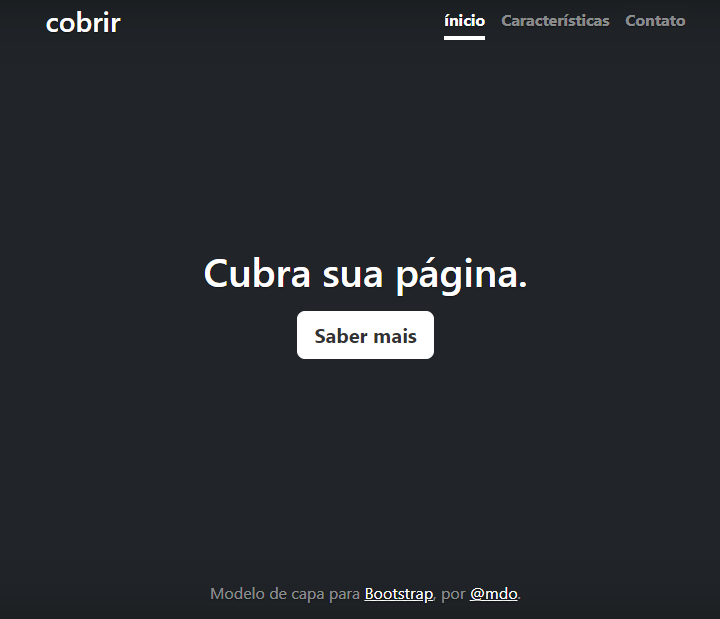

# Indice

[Portfolio_pessoal](#portfolio_pessoal)  
[Descrição](#descri%C3%A7%C3%A3o)  
[Introduçao](#introdu%C3%A7ao)  
[Funcionalidade](#funcionalidade)  
[Tecnologias Utilizadas](#tecnologias-utilizadas)  
[Fontes Consulta](#fontes-consulta)  
[Autores](#autores)  

 # Portfolio_pessoal
 

projeto criado utilizando exemplo do Bootstrap para ensino de uso do README e do Bootstrap.

## Descrição
O Portifólio Pessoal é um projeto que foi executado em sala de aula com a intenção de ampliar o desenvolvimento dos alunos ao fazer o arquivo README. O projeto teve auxiliação do Bootstrap para a página inicial, tanto o CSS quanto HTML.
## Introduçao
Ao fazer o projeto aprendemos a utilizar o Bootstrap e também a desenvolver melhor nossa habilidade na construção do arquivo README.
 Bootstrap é um framework web com código-fonte aberto para desenvolvimento de componentes de interface e front-end para sites e aplicações web, usando HTML, CSS e JavaScript, baseado em modelos de design para a tipografia, melhorando a experiência do usuário em um site amigável e responsivo.  
  O arquivo README é muito importante para nossa aprendizagem e nosso desenvolvimento dentro e fora do colégio.
## Funcionalidade
Os campos de cadastro constam com informações de endereço somente.
## Tecnologias Utilizadas
HTML,CSS,VSCODE, BOOTSTRAP,GITHUB,GIT.
## Fontes Consulta
https://www.alura.com.br/artigos/escrever-bom-readme
https://gist.github.com/lohhans/f8da0b147550df3f96914d3797e9fb89
## Autores